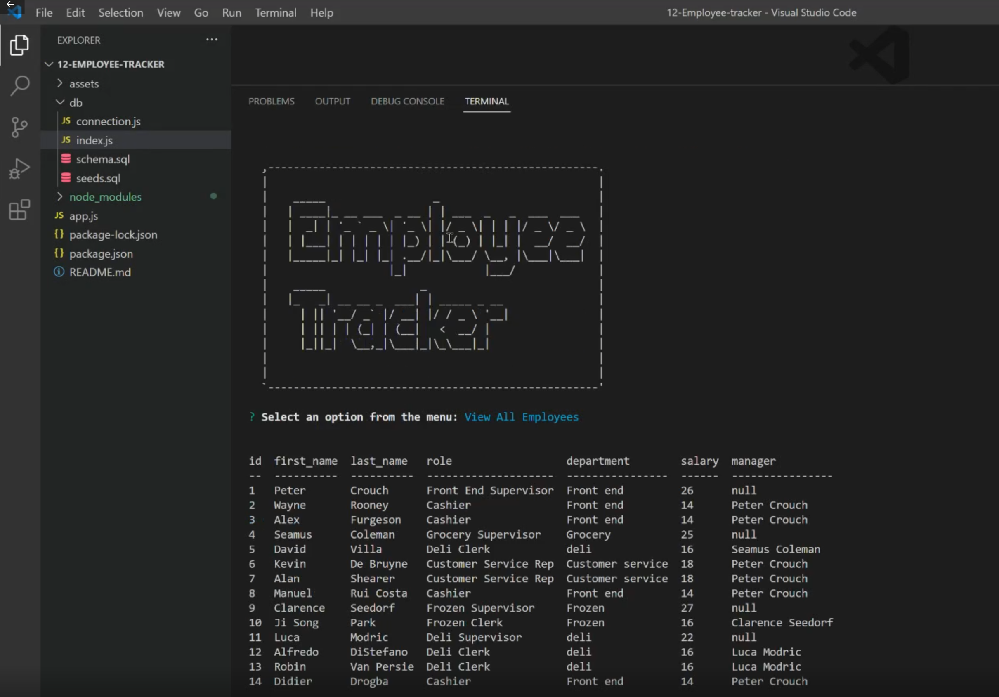

# Employee Tracker
  
  ## Table of Contents:

  <a href="#Description">Description</a>
  <a href="#Installation">Installation</a>
  <a href="#Usage">Usage</a>
  <a href="#Contributing">Contributing</a>
  <a href="#Tests">Tests</a>
  <a href="#Questions/feedback">Questions/feedback</a>
  <a href="#License">License</a>

  ## Description
  
  This tool allows you to build a database in the command line to save information about your company.  Keep track of employees, departments, roles, salaries, and budget with this useful inquirer tool.
  
  ## Installation
  
  To install, download the files and open the folder in vscode.  Open the terminal and use the 'npm i' command.  Now the application is ready to start.

  ## Usage

  To use this application, enter the 'npm start' command.  Inquirer will start in the terminal and a list of options will appear.  Simply navigate the menu and follow all prompts to enter/view/manipulate the data in your db.  
  
  ## Contributing
  
  No contributions at this time.

  ## Tests

  To test this application, follow instruction to install and run.  From there select each option from the menu one at a time.  Testing the view commands only require one click but after adding, removing, or updating data: use the view options to check any changes made.

  ## Demo video

  

  ## Questions/feedback

  Please log any issues and check out my projects on Github!  <a href='https://github.com/Wdiste'>Visit Github</a>

  To contact me with any questions, please send an email: <a href="mailto:wdiste49@gmail.com?subject=Feedback&body=Message)">Send Feedback</a>

  
  
